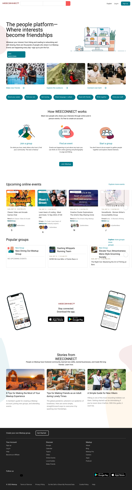
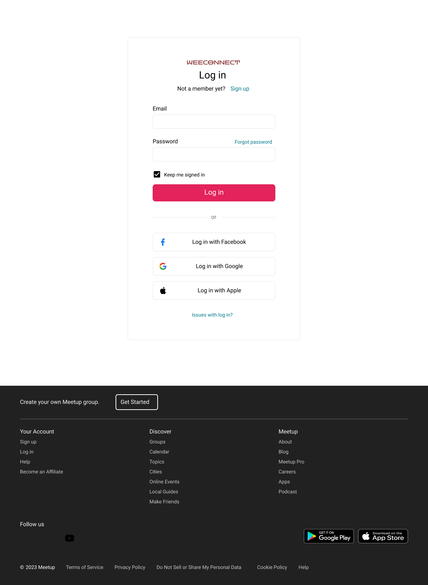
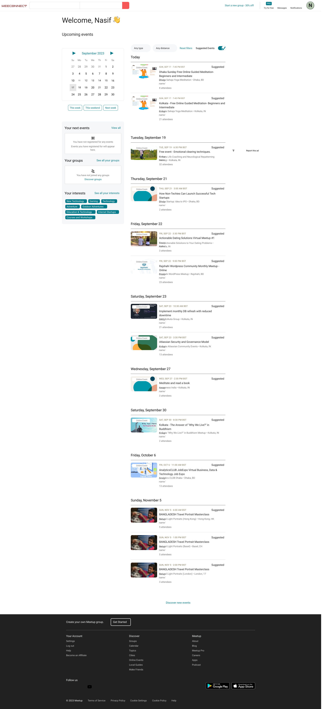

# Title: WeeConnect

# Idea:
    An all-in-one place to find people that have similar interests, join events or organize your own events. Where interests become community, career, friendships.
# Merits: 
    - You can find people from all around that have similar interests
    - Create groups with people, chat online, or hangout face-to-face
    - Find events matching your interests organized by other people, or organize a event of your own
    - Share ideas, form a community of like minded people
    - Build a network for career success
    - Build lasting friendships

# Existing Software: [Meetup](https://www.meetup.com/)

# Language Specification:
## Backend: [Supabase](https://supabase.com/)

# Pages:
## Homepage

## Login/Register

## Dashboard

